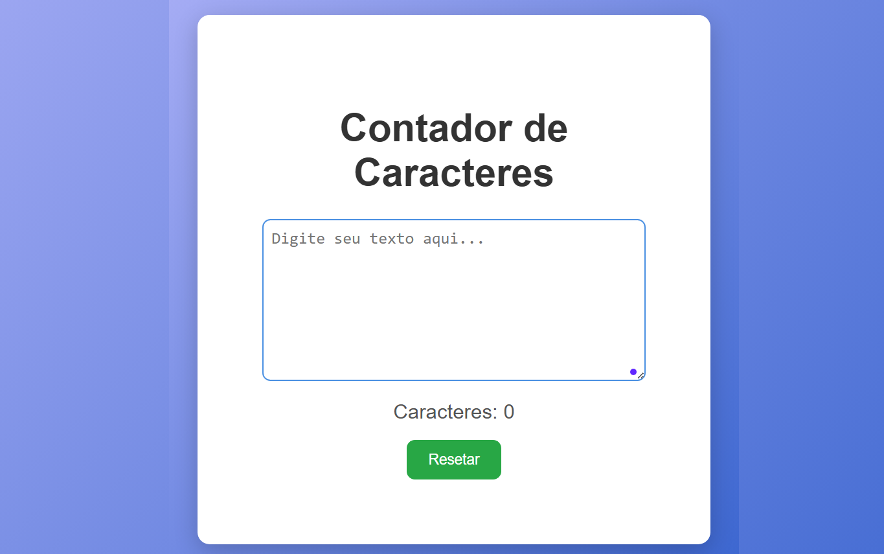

# Contador de Caracteres



## Demo ao Vivo
[Ver projeto funcionando](https://mbarros-ux.github.io/Contador-de-caracteres/)

## Sobre
Aplicação web simples para contagem de caracteres em tempo real, desenvolvida com HTML, CSS e JavaScript puro. O projeto permite que o usuário digite um texto e visualize imediatamente a quantidade de caracteres digitados, com opção de resetar o contador.

Este projeto foi criado para praticar manipulação de eventos em JavaScript, atualização dinâmica do DOM e criação de interfaces funcionais com feedback imediato ao usuário.

## Tecnologias Utilizadas
- HTML5 - Estrutura semântica do formulário
- CSS3 - Estilização, layout responsivo e design limpo
- JavaScript - Lógica de contagem e manipulação do DOM

## Funcionalidades
- Contagem de caracteres em tempo real
- Atualização automática ao digitar
- Botão de resetar para limpar o texto e o contador
- Interface limpa e intuitiva
- Design responsivo (adapta-se a diferentes tamanhos de tela)
- Feedback visual imediato ao usuário
- Textarea expansível para textos longos

## Como Executar

1. Clone este repositório:
```bash
git clone https://github.com/mbarros-ux/Contador-de-caracteres.git
```

2. Abra o arquivo `index.html` em seu navegador.
